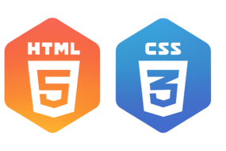
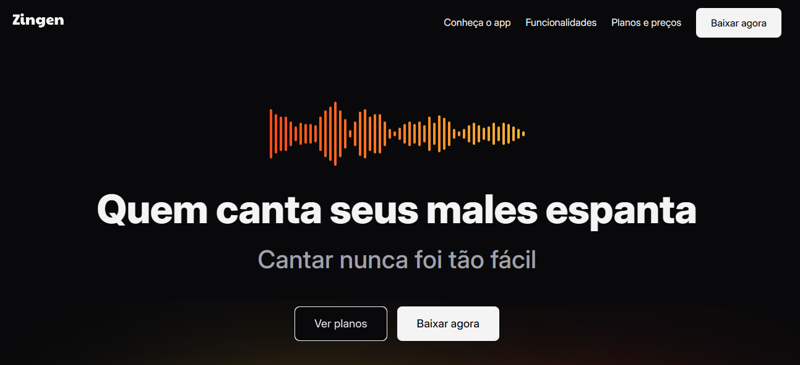

# 🎤 Zingen - Landing Page

Bem-vindo ao repositório da **Landing Page do Zingen**, meu primeiro projeto de landing page!  
Este projeto representa um grande passo na minha jornada como desenvolvedor(a), trazendo muitos desafios e aprendizados.

---

## 🚀 Sobre o Projeto

Zingen é um modelo de aplicativo de karaokê moderno e estiloso.  
A landing page foi criada com foco em design atrativo, responsividade e experiência de usuário fluida.

### ✨ Destaques:

- Scroll suave com **scroll-smooth**
- Layout moderno utilizando **Tailwind CSS**
- Estrutura leve em **HTML**
- Ícones com degradê e letras estilizadas
- Imagens de alta qualidade
- Sessões com **cards de assinatura**
- Área de **download do produto**
- Responsividade e **compatibilidade mobile**

---

## 🛠️ Tecnologias Utilizadas

- HTML5  
- Tailwind CSS  
- Scroll Smooth (comportamento de rolagem suave)
- Design responsivo

## 📌 Observações
Esse projeto é apenas um modelo de produto e foi desenvolvido com fins educacionais.
Todo o layout foi pensado para apresentar de forma clara e atrativa um aplicativo fictício de karaokê.

## 📸 Preview

